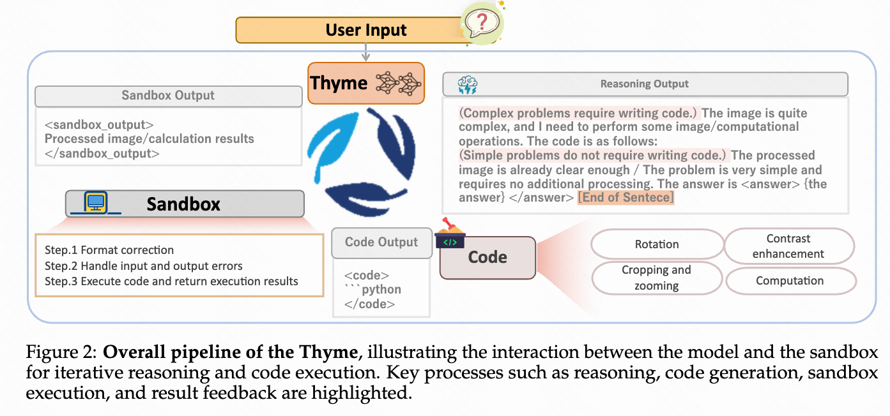
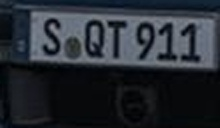

<p align="center" width="40%">

</p>

<font size=7><div align='center' >  
[[📖 Home Page](https://thyme-vl.github.io/)] 
[[📖 Technique Report](https://arxiv.org/abs/2508.11630)] 

[[📊 Thyme SFT Model](https://huggingface.co/Kwai-Keye/Thyme-SFT)] 
[[📊 Thyme RL Model](https://huggingface.co/Kwai-Keye/Thyme-RL)] 
[[📝 SFT Data](https://huggingface.co/datasets/Kwai-Keye/Thyme-SFT)] 
[[📝 RL Data](https://huggingface.co/datasets/Kwai-Keye/Thyme-RL)] 
</div></font>

## 🔥 News
* **`2025.08.18`** 🌟 We are excited to introduce **Thyme: Think Beyond Images**. Thyme transcends traditional ``thinking with images'' paradigms by autonomously generating and executing diverse image processing and computational operations through executable code, significantly enhancing performance on high-resolution perception and complex reasoning tasks. Leveraging a novel two-stage training strategy that combines supervised fine-tuning with reinforcement learning and empowered by the innovative GRPO-ATS algorithm, Thyme achieves a sophisticated balance between reasoning exploration and code execution precision.

<p align="center" width="100%">

</p>


---
# Table of Contents

1. [Quick Start](#1-quick-start)
2. [Data Preparation](#2-data-preparation)
3. [Supervised Fine-Tuning (Thyme-SFT)](#3-supervised-fine-tuning-thyme-sft)
4. [Reinforcement Learning (Thyme-RL)](#4-reinforcement-learning-thyme-rl)
5. [Evaluation](#5-evaluation)
6. [Usage Example: How to use Thyme](#6-usage-example-how-to-use-thyme)
7. [Citation](#citation)
8. [Related Projects](#related-projects)

---

## 1. Quick Start

### 1.1 Clone the Repository

```bash
git clone https://github.com/yfzhang114/Thyme.git
cd Thyme
```

### 1.2 Environment Setup & Dependency Installation

We recommend creating a Conda environment for isolation and installing dependencies as follows:

```bash
conda create -n Thyme python=3.10 -y
conda activate Thyme

pip install -e .
pip install "sglang[all]" -U
pip install "vllm>=0.5.1" "transformers<4.55" "trl<0.21" -U
pip install "lmdeploy>=0.5,<0.9" -U --no-deps
pip install autoawq -U --no-deps
pip install auto_gptq optimum bitsandbytes "gradio<5.33" -U
pip install git+https://github.com/modelscope/ms-swift.git
pip install timm -U
pip install "deepspeed<0.17" -U
pip install qwen_vl_utils qwen_omni_utils decord librosa icecream soundfile -U
pip install liger_kernel nvitop pre-commit math_verify py-spy -U
pip install wandb

pip install flash-attn --no-build-isolation --use-pep517

```

---

## 2. Data Preparation

### 2.1 Download Dataset

Obtain the training data from the [HuggingFace Dataset Page](https://huggingface.co/datasets/Kwai-Keye/Thyme-SFT). The SFT dataset consists of three splits:

* `wo_thinking_thyme_single_round`: Single-turn image operation data
* `2round`: Multi-turn dialogue data
* `computation`: Annealing data used for computational tasks

Each sample’s `image` field is a list containing the original and processed images.

### 2.2 Process Images and Update Paths

Before training, ensure all referenced images are downloaded and saved locally. Update the dataset files (e.g., `.jsonl`) by replacing image URLs or remote paths with local absolute paths, for example:

```json
"image": [
  "/path/to/original_images/0904.0709_0.jpg",
  "/path/to/processed_images/0904.0709_0_6349.jpg"
]
```

```
#!/usr/bin/env python3
import os, json, base64
from pathlib import Path
from concurrent.futures import ThreadPoolExecutor, as_completed
from datasets import load_dataset
from tqdm import tqdm
import io
from PIL import Image

HF_DATA_DIR = "./data/Thyme-SFT"
ROOT_OUT    = Path("Thyme_sft_data")
IMG_ROOT    = './data/Thyme_sft_data/img'
JSONL_ROOT  = ROOT_OUT / "jsonl"
SPLITS      = ["wo_thinking_thyme_single_round", "2round", "computation"] #,  
MAX_WORKERS = os.cpu_count()      # Can be adjusted based on machine specs

# IMG_ROOT.mkdir(parents=True, exist_ok=True)
JSONL_ROOT.mkdir(parents=True, exist_ok=True)

# ----------- Thread pool task -----------
def save_one_image(args):
    """
    Decode Base64 string, handle transparency and save image as JPEG.

    Args:
        args (tuple): Tuple containing (b64_str, save_path).
    """
    b64_str, save_path = args
    if os.path.exists(save_path):
        return save_path

    try:
        # 1. Decode Base64 to get raw binary data
        image_bytes = base64.b64decode(b64_str)

        # 2. Use Pillow to open image from binary data
        with Image.open(io.BytesIO(image_bytes)) as img:
            # 3. Handle transparency (key step)
            # Check if image mode needs transparency handling.
            # 'P' mode may contain transparency, 'LA' is grayscale+transparency.
            # 'RGBA' is the most common mode with transparency.
            if img.mode in ("RGBA", "LA", "P"):
                # To uniformly handle all transparency cases, first convert image to RGBA mode.
                # If image is in 'P' mode with transparency, conversion will result in correct RGBA image.
                img = img.convert("RGBA")

                # Create a white background base image
                background = Image.new("RGB", img.size, (255, 255, 255))

                # Paste original image onto the background.
                # At this point img is already in RGBA mode, so it can serve as its own mask.
                # Pillow will automatically use its Alpha channel.
                background.paste(img, (0, 0), img)
                img = background # Now img is the merged RGB image

            # If image mode is not RGB (e.g., 'L', 'CMYK', etc.), convert to RGB
            elif img.mode != "RGB":
                img = img.convert("RGB")

            # 4. Save image in JPEG format
            # JPEG doesn't support transparency, so background filling is necessary.
            img.save(save_path, "jpeg", quality=95) # Recommend adding quality parameter

        return str(save_path)

    except Exception as e:
        # Add exception handling for debugging which image caused the problem
        print(f"Error processing image for {save_path}: {e}")
        return None

# ----------- Main processing -----------
for split in SPLITS:
    print(f"\n>>> Processing split : {split}  (max_workers={MAX_WORKERS})")
    # 3. Write jsonl, check if already exists
    jsonl_path = JSONL_ROOT / f"{split}.jsonl"
    if not jsonl_path.exists():  # Only write if jsonl file doesn't exist
        print(f"  JSONL  -> {jsonl_path}")
    else:
        print(f"  JSONL already exists: {jsonl_path}")

    ds = load_dataset(HF_DATA_DIR, split=split)

    img_dir = IMG_ROOT + '/' + split
    # img_dir.mkdir(exist_ok=True)

    # 1. First collect all tasks to be saved
    tasks = []               # (b64_str, save_path)
    records = []             # For writing jsonl
    for sample_idx, sample in enumerate(ds):
        img_paths = []
        for img_idx, b64_img in enumerate(sample["image"], start=1):
            img_name = f"{sample_idx+1:08d}_{img_idx:02d}.jpg"
            img_path = img_dir + '/' + img_name
            tasks.append((b64_img, img_path))
            img_paths.append(str(img_path))
        records.append({
            "image": img_paths,
            "question": sample["question"],
            "response": sample["response"]
        })

    # 2. Execute with multi-threading
    with ThreadPoolExecutor(max_workers=MAX_WORKERS) as pool:
        # Only save images that don't already exist
        saved_images = list(tqdm(pool.map(save_one_image, tasks),
                                 total=len(tasks), desc="Saving images"))
    
    # Filter out items that returned None (i.e., files that already existed)
    saved_images = [img for img in saved_images if img is not None]

    with open(jsonl_path, "w", encoding="utf-8") as f:
        for rec in records:
            f.write(json.dumps(rec, ensure_ascii=False) + "\n")
    
    print(f"  Images -> {img_dir}  ({len(saved_images)} files)")

print("\nAll done (multi-threaded)!")

```

### 2.3 File Path Conversion for System Integration

In every question, there is a specified file path that needs to be converted into the correct system path for use in our platform. The following steps outline the process for handling these paths.

#### Conversion Process:

1. **Original Path Format**:

   * Example: `"User Image Path: \"/mllm_hdd/yfzhang/data/temp_processed_images/cauldron_dvqa_images_dvqa_00110792.png_rotated_image_318.png\""`

2. **Transformation**:

   * Extract the filename from the original path.
   * Convert it into the first element of the `image` array in the system.
   * This element will represent the correct file path for the system.

3. **Response Path Conversion**:

   * Similarly, ensure that any corresponding absolute paths provided in the `response` are transformed to match the system format as described.

---

## 3. Supervised Fine-Tuning (Thyme-SFT)

### 3.1 Training Data Format

Training samples follow this JSON format example (full dataset includes similar structures):

```json
{
  "image": ["/path/to/original.jpg", "/path/to/processed.jpg"],
  "question": "<image>\nBased on the top-right graph, describe the behavior of P(z) as z approaches zero. Options:\n...",
  "response": "<think>Detailed reasoning and executable code...</think><answer>B</answer>"
}
```

### 3.2 Configure Training Paths

Set these variables in your training script or environment:

* `DATASET`: Path to your training dataset
* `SAVE_PATH`: Directory to save the trained model
* `Model`: Path to your model

### 3.3 Run Training

Execute the training scripts:

```bash
sh scripts/sft_stage1.sh   # Stage 1: Supervised fine-tuning
sh scripts/sft_stage2.sh   # Stage 2: Computational Data Annealing
```

**Note:** Since the computational data contains samples with and without images, this stage requires these two types of data to be processed and input separately. Please ensure your script handles this accordingly.

---

## 4. Reinforcement Learning (Thyme-RL)

### 4.1 RL Dataset Format

Each RL data sample follows this structure:

```json
{
  "messages": [
    {
      "role": "system",
      "content": "You are a helpful assistant. Solve the problem step-by-step..."
    },
    {
      "role": "user",
      "content": "<image>\nQuestion text...\n"
    }
  ],
  "images": ["/path/to/image.jpg"],
  "solution": "black",
  "question": "What is the color of the glasses frame of the man in the white shirt?"
}
```

### 4.2 Reward Model Configuration

* Reward functions are implemented in `examples/train/grpo/plugin/agent_rm.py`, supporting `fmt_orm`, `vqa_orm`, and `cst_orm` by default.
* For multi-node training, configure `REWARD_API_ADDRESS` and `QWEN_API_PORT` in `.deepspeed_env`.
* Single-node training can use the default environment variables.

Example asynchronous function calling the reward model API:

```python
async def llm_openai_api(messages, ip="0.0.0.0", host="8080", temperature=0.1, max_tokens=256, top_p=None, n=1):
    openai_api_base = f"http://{ip}:{host}/v1"
    async with httpx.AsyncClient(timeout=httpx.Timeout(600.0)) as client:
        model = "/mllm_hdd/yfzhang/models/Qwen2.5-VL-72B-Instruct-AWQ"
        resp = await client.post(
            f"{openai_api_base}/chat/completions",
            headers={"Content-Type": "application/json"},
            json={
                "model": model,
                "messages": messages,
                "temperature": temperature,
                "max_tokens": max_tokens,
                "top_p": top_p,
                "n": n,
            },
        )
        resp.raise_for_status()
        response_data = resp.json()
        return [choice["message"]["content"] for choice in response_data["choices"]]
```

### 4.3 Launch RL Training

Run the script:

```bash
sh scripts/rl.sh
```

Parameters explained:

* `--O3 true` activates Thyme training configuration with multi-turn dialogue and sandboxed iterative output processing.
* `--stop_words ...` defines output termination tokens; enabling GRPO-ATS with sampling temperature set to 0 when `<code>` is a stop word.


## 5. Evaluation

We recommend using [VLMEvalKit](https://github.com/open-compass/VLMEvalKit) for automatic evaluation on benchmarks.


### 5.1  Install VLMEvalKit
```shell
cd eval/VLMEvalKit
pip install -e .
```

### 5.2 Evaluate on Multiple Benchmarks
    
For example, to evaluate on `V*` and `HRBench` with 8 GPUs, simply run (under `eval/VLMEvalKit` directory):
```shell
torchrun --nproc-per-node=8 run.py --data VStarBench HRBench4K HRBench8K --model Thyme-7B --verbose
```
  

## 6. Usage Example: How to use Thyme

We provide a simple script (`eval/inference.py`) to inference on custom cases. Simply run:
```shell
python -m eval.inference
```
You may modify the user question and image path for your own cases:
```python
# --- 3. Prepare Input Data (Example) ---
# Example question and responses (replace with your actual data)
# Example case (sampled from MME-RealWorld-Lite bench)
question_text = ("Question: What is the plate number of the blue car in the picture?\nOptions:\n"
                 "A. S OT 911\n"
                 "B. S TQ 119\n"
                 "C. S QT 911\n"
                 "D. B QT 119\n"
                 "E. This image doesn't feature the plate number.\n"
                 "Please select the correct answer from the options above.")
image_path = "eval/17127.jpg"
```
<details>
<summary>Visualization of the Provided Example</summary>


### ❓ User Prompt
```
Question: What is the plate number of the blue car in the picture?
Options:
A. S OT 911
B. S TQ 119
C. S QT 911
D. B QT 119
E. This image doesn't feature the plate number.
Please select the correct answer from the options above.
```

---

### 🤖 Model Response
> \<think>To determine the plate number of the blue car in the image, we need to focus on the license plate located near the bottom front of the vehicle. The plate is relatively small compared to the overall size of the car and the image, so zooming in on this specific area will help us clearly read the characters on the plate.<br>
The coordinates for the license plate appear to be around the lower front section of the car, specifically near the center of the lower part of the image. Cropping and zooming in on this region will enhance the visibility of the text on the plate, making it easier to identify the correct option.<br>
Here is the Python code to crop and zoom in on the license plate area:<br>

> \<code>
```python
import cv2
import os
import numpy as np
from uuid import uuid4

# Load the image
image_path = "/eval/17127.jpg"
image = cv2.imread(image_path)

# Define the coordinates for the license plate area (inferred from the image content)
x1, y1, x2, y2 = 1250, 1030, 1360, 1070

# Crop the image based on the defined coordinates
cropped_image = image[y1:y2, x1:x2]

# Apply a zoom factor to enhance the cropped region
zoom_factor = 2
resized_image = cv2.resize(cropped_image, None, fx=zoom_factor, fy=zoom_factor, interpolation=cv2.INTER_CUBIC)

# Save the processed image with a random suffix
random_suffix = str(uuid4())[:8]
processed_filename = f"17127_{random_suffix}.jpg"
processed_path = os.path.join("/mnt/data/temp_processed_images/", processed_filename)
cv2.imwrite(processed_path, resized_image)

# Print the path of the saved cropped image for further processing
print(processed_path)
```
> \</code>

> \<sandbox_output>
\</sandbox_output>

>Upon examining the cropped and zoomed-in image of the license plate, it becomes clear that the characters are "S QT 911". This matches option C. Therefore, the correct answer is C. S QT 911.\</think><br>

\<answer> **C. S QT 911** \</answer>

</details>

## Citation

If you find Thyme useful in your research or applications, please cite our paper:

```bibtex
@misc{zhang2025thymethinkimages,
      title={Thyme: Think Beyond Images}, 
      author={Yi-Fan Zhang and Xingyu Lu and Shukang Yin and Chaoyou Fu and Wei Chen and Xiao Hu and Bin Wen and Kaiyu Jiang and Changyi Liu and Tianke Zhang and Haonan Fan and Kaibing Chen and Jiankang Chen and Haojie Ding and Kaiyu Tang and Zhang Zhang and Liang Wang and Fan Yang and Tingting Gao and Guorui Zhou},
      year={2025},
      eprint={2508.11630},
      archivePrefix={arXiv},
      primaryClass={cs.CV},
      url={https://arxiv.org/abs/2508.11630}, 
}
```

## Related Projects
Explore other related work from our team:

- [Kwai Keye-VL](https://github.com/Kwai-Keye/Keye)
- [R1-Reward: Training Multimodal Reward Model Through Stable Reinforcement Learning](https://github.com/yfzhang114/r1_reward)
- [MM-RLHF: The Next Step Forward in Multimodal LLM Alignment](https://mm-rlhf.github.io/)
- [MME-RealWorld: Could Your Multimodal LLM Challenge High-Resolution Real-World Scenarios that are Difficult for Humans?](https://github.com/yfzhang114/MME-RealWorld)
- [MME-Survey: A Comprehensive Survey on Evaluation of Multimodal LLMs](https://arxiv.org/abs/2411.15296)
- [Beyond LLaVA-HD: Diving into High-Resolution Large Multimodal Models](https://github.com/yfzhang114/SliME)
- [VITA-1.5: Towards GPT-4o Level Real-Time Vision and Speech Interaction](https://github.com/VITA-MLLM/VITA)
